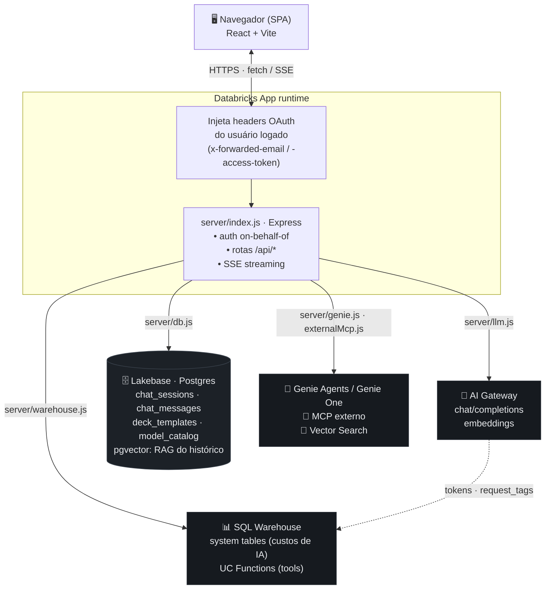

# AI Prism

Ambiente de chat multimodelo construído como **Databricks App**, que expõe uma interface
única para conversar com diversos LLMs (Anthropic, OpenAI, Google, Meta, Alibaba, Zhipu)
servidos pelo **Databricks AI Gateway**, com histórico persistido em **Lakebase (Postgres)**
e autenticação on-behalf-of do usuário logado no workspace. Além do chat, gera artefatos
reais editáveis — apresentações `.pptx`, planilhas `.xlsx` e gráficos interativos — e chama
ferramentas nativas do workspace (Genie, Python, Vector Search, UC Functions, MCP externo).

## Visão geral

- **Frontend**: SPA em React 18 + Vite + Tailwind CSS.
- **Backend**: servidor Express (Node 18+) que faz proxy autenticado para o AI Gateway e
  persiste sessões/mensagens no Postgres.
- **Modelos**: acessados via endpoint OpenAI-compatible do AI Gateway
  (`/serving-endpoints/chat/completions` e `/serving-endpoints/embeddings`), sem SDKs de
  provedor — apenas `fetch`.
- **Persistência**: Lakebase Postgres, com autenticação por token OAuth do próprio usuário
  (sem service principal / credenciais fixas).
- **Deploy**: roda como Databricks App (`app.yaml`), servindo o build estático do client a
  partir do próprio processo Express.

## Arquitetura

Toda credencial é *on-behalf-of* do usuário logado (ver abaixo). O servidor Express
é a única porta de entrada; ele fala com quatro serviços da Databricks, sempre com o
token OAuth do próprio usuário — nada de credencial estática.



> O diagrama acima usa [Mermaid](https://mermaid.js.org/) (renderizado nativamente
> pelo GitHub). A seta pontilhada AI Gateway → SQL Warehouse indica que o consumo de
> tokens de cada chamada ao gateway é gravado nas *system tables*, de onde o
> **dashboard AI/BI de custos** (ver [`dashboards/`](dashboards/)) lê o custo real
> faturado (DBU × preço) por usuário — fora do app, para que nenhuma consulta pesada
> ao warehouse trave a UI.

### Autenticação (on-behalf-of)

O app não usa nenhuma credencial estática. Em produção, o runtime da Databricks App injeta
em cada requisição os headers `x-forwarded-email` e `x-forwarded-access-token` do usuário
autenticado no workspace. O servidor usa esse mesmo token para:

- chamar o AI Gateway (`Authorization: Bearer <token>`); e
- autenticar no Lakebase, onde o token OAuth do usuário funciona como *senha* da conexão
  Postgres (`server/db.js`). Como o token gira a cada ~1h, cada operação de banco abre uma
  conexão curta e nova (`withClient`) em vez de usar um pool — evita reutilizar credenciais
  expiradas.

Em desenvolvimento local, na ausência desses headers, o servidor cai para as variáveis de
ambiente `DATABRICKS_USER_EMAIL` / `DATABRICKS_USER_TOKEN`.

### Fluxo de uma mensagem de chat

1. O client envia `multipart/form-data` para `POST /api/chat` (prompt + anexos opcionais).
2. O servidor extrai texto de qualquer anexo (`server/files.js`) e monta o histórico da
   sessão a partir do Postgres.
3. A resposta é transmitida como **Server-Sent Events** (`text/event-stream`) token a
   token, repassando o streaming do AI Gateway diretamente para o navegador.
4. Ao final, a mensagem do assistente (com contagem de tokens) é persistida, o embedding
   de busca semântica da sessão é recalculado, e — na primeira troca — um título
   (emoji + poucas palavras) é gerado automaticamente por um modelo rápido.

## Estrutura do projeto

```
ai-prism/
├── app.yaml                # manifesto da Databricks App (comando, env, escopo OAuth)
├── server/
│   ├── index.js             # rotas Express, SSE, auth on-behalf-of, loop de tools
│   ├── llm.js                # catálogo de modelos + client do AI Gateway (chat/embeddings)
│   ├── db.js                 # schema e queries do Lakebase (sessões/mensagens/decks/planilhas)
│   ├── files.js              # extração de texto de anexos (pdf/docx/xlsx/pptx/texto)
│   ├── analysis.js           # parsing determinístico de planilhas + candidatos de gráfico
│   ├── blocks.js             # protocolo de blocos estruturados (fence prism-blocks)
│   ├── tools.js              # tool calling: Python, Genie, Vector Search, UC Functions, MCP
│   ├── genie.js              # Genie Spaces + Genie One (MCP gerenciado)
│   ├── decks.js              # geração/validação de decks e export para .pptx
│   ├── xlsx-export.js        # renderização de planilhas para .xlsx real
│   └── warehouse.js          # execução SQL (Statement Execution) para UC Functions/Python
├── client/
│   ├── src/
│   │   ├── App.jsx             # estado global, orquestra sessões/streaming/tema
│   │   ├── api.js               # cliente HTTP + parser do stream SSE
│   │   ├── lib/pptxMining.js     # mineração de design system de .pptx (cores, ícones, diagramas)
│   │   ├── components/
│   │   │   ├── Sidebar.jsx        # histórico, busca semântica, tema, sessão
│   │   │   ├── Composer.jsx       # input, anexos (drag&drop), ditado por voz
│   │   │   ├── Message.jsx        # renderização markdown, blocos, custo/tokens, ações
│   │   │   ├── ModelPicker.jsx    # seletor de modelo do AI Gateway
│   │   │   ├── SettingsModal.jsx  # personas, system prompt, temperatura
│   │   │   ├── VoiceOverlay.jsx   # modo de conversação por voz (full-duplex)
│   │   │   ├── ToolsPicker.jsx    # habilita ferramentas nativas por sessão
│   │   │   ├── DeckStudio.jsx     # editor de slides (canvas de elementos) + export .pptx
│   │   │   ├── SpreadsheetStudio.jsx # editor de planilha + export .xlsx
│   │   │   ├── Welcome.jsx        # tela inicial com sugestões de prompt
│   │   │   └── blocks/             # Chart/Table/Insight/Deck/Spreadsheet + BlockRenderer
│   │   └── lib/speech.js         # wrappers da Web Speech API (STT/TTS)
│   └── dist/                 # build de produção (servido pelo Express)
└── server-dist/index.cjs   # bundle CJS do servidor (gerado por esbuild)
```

## Funcionalidades já embarcadas

### Chat multimodelo
- Catálogo curado de modelos via AI Gateway (`server/llm.js`): família Claude 5
  (Sonnet 5, Opus 4.8, Fable 5, Haiku 4.5), GPT-5.6 / GPT-5 mini, Gemini 3 Pro /
  Gemini 3.5 Flash, Llama 4 Maverick, GLM-5.2, Qwen3.5 122B e GPT-OSS 120B — cada um com
  provedor, indicação de suporte a visão, suporte a tools e preços aproximados (usados só
  para estimativa de custo na UI).
- Troca de modelo por sessão a qualquer momento (`ModelPicker`), com preferência lembrada
  em `localStorage`.
- Tratamento por modelo das particularidades do Gateway: modelos que não aceitam
  `temperature` custom (`noTemperature`), os que recebem `stream_options.include_usage`
  (`streamUsage`) e o teto de `max_tokens` por modelo (`maxOut`) — parte curada à mão,
  parte sondada ao vivo no gateway.

### Streaming de respostas
- Respostas transmitidas via SSE, token a token, com cursor de "digitando" na UI e opção
  de **parar a geração** a qualquer momento.
- Métricas de uso (tokens de entrada/saída) e custo estimado exibidos por mensagem quando
  disponíveis.

### Sessões e histórico
- Sessões persistidas em Lakebase, agrupadas na sidebar por período (Hoje / Ontem /
  Últimos 7 dias / Últimos 30 dias / Mais antigos).
- Título automático (emoji + poucas palavras, no idioma do usuário) gerado por um modelo
  rápido (Claude Haiku 4.5) na primeira mensagem de cada sessão.
- Renomear e excluir sessões inline.
- Regenerar a última resposta do assistente, com **versões navegáveis** — cada regeneração
  vira uma variante browsável (carrossel de versões) em vez de sobrescrever a anterior.
- Editar um prompt já enviado e regenerar a resposta a partir da nova redação.
- **Recuperação de turno interrompido**: se o servidor cair ou o token expirar no meio da
  geração, a conversa fica com uma mensagem do usuário sem resposta — a UI oferece um botão
  "Gerar resposta" (`POST /api/sessions/:id/continue`) para completar o turno sem perder o
  contexto.

### Busca semântica no histórico
- Campo de busca na sidebar (`/api/search`) que embeda a query com um modelo multilíngue
  (`qwen3-embedding-0-6b`, com prompt de instrução assimétrico) e ranqueia sessões por
  similaridade de cosseno com o embedding do conteúdo do usuário.
- Embeddings calculados e persistidos de forma incremental (backfill preguiçoso) conforme
  as sessões são usadas/buscadas.

### Anexos de documentos
- Upload múltiplo (até 10 arquivos, 25MB cada) com extração de texto para o contexto do
  modelo: PDF, DOCX, PPTX, XLSX/XLS e formatos de texto simples (txt, md, csv, json, log,
  tsv, xml, html, yaml).
- Suporte a arrastar-e-soltar (drag & drop) no composer.
- Conteúdo truncado em 50k caracteres por arquivo para não estourar o contexto.

### Mensagens estruturadas e gráficos interativos
Além de markdown, uma resposta do assistente pode carregar **blocos estruturados**
(`chart`, `table`, `insight`) renderizados inline no chat, persistidos junto da mensagem
(`chat_messages.blocks`, JSONB) e reidratados ao reabrir a sessão.

- Ao anexar uma **planilha (XLSX/XLS/CSV)**, `server/analysis.js` faz o parsing e computa,
  de forma **determinística** (nunca via LLM, para não haver números alucinados): tipo de
  cada coluna (numérica/categórica/data), estatísticas básicas e uma lista de *candidatos de
  gráfico* (agregações reais: categoria×métrica → barra/pizza, data×métrica → linha).
- O modelo recebe apenas uma descrição compacta desses candidatos (`describeCandidates`) e,
  se achar útil, seleciona/narra alguns terminando a resposta com um bloco cercado interno
  (` ```prism-blocks ` — nunca exibido ao usuário, `server/blocks.js` extrai e valida). O
  backend resolve as referências contra os dados reais e envia um evento SSE
  `{ type: 'blocks', blocks }` após o streaming de texto terminar.
- O frontend despacha cada bloco em `client/src/components/blocks/` (`ChartBlock` — barra,
  linha, área e pizza via Recharts —, `TableBlock`, `InsightCard`). Sem dados suficientes
  para um gráfico confiável, nenhum bloco é forçado — a resposta permanece só texto.
- Além do modo por referência (`candidate_N`), o bloco `chart` aceita **série em linha**
  fornecida pelo próprio modelo (`chartType` + `series→data→{label,value}`) — o caminho para
  dados que vieram de uma tool (Genie/Python) e não de um anexo, com regra de honestidade:
  os pontos só podem ser números reais já presentes na conversa, nunca fabricados.
- Documentos (PDF/DOCX) hoje geram síntese + insights em texto; extração de dados
  estruturados desses formatos é um fast-follow.

### Ferramentas nativas do workspace (tool calling)
- Cada sessão pode habilitar ferramentas (`ToolsPicker`), invocadas com o token
  on-behalf-of do usuário — então tudo respeita as permissões reais dele, sem sandbox
  próprio: **Python** (UC Function provisionada sob demanda, executada no sandbox serverless
  governado da Databricks), **Genie** (Spaces específicos) e **Genie One** (MCP gerenciado,
  amplo ao workspace), **Vector Search**, **UC Functions** avulsas e **MCP externo** via
  conexão do Unity Catalog.
- Resultados tabulares de Genie/Genie One viram **candidatos de gráfico determinísticos**
  (o Genie One tem sua tabela markdown parseada de volta em linhas), reaproveitando o mesmo
  pipeline confiável dos anexos de planilha.
- O modelo **narra antes de cada chamada** (o quê e por quê), e a UI mostra um chip por
  tool call — interleaved no ponto exato da narrativa — mais um indicador de "pensando"
  entre rodadas, para o trabalho nunca parecer travado.
- O loop de ferramentas tem um teto alto (backstop anti-runaway) e **detecção de chamada
  idêntica repetida** como anti-loop real; ao encerrar, uma rodada de síntese sem tools
  garante que a resposta/artefato final seja sempre escrita, com aviso honesto se foi
  cortado cedo.

### Planilhas (.xlsx)
- Pedidos explícitos de planilha geram um bloco `spreadsheet` (irmão tabular do `deck`):
  abas com blocos ordenados (título/nota/seção/tabela) + gráficos nativos, com preview
  ao vivo no chat e exportação para um `.xlsx` **real** — fórmulas que recalculam,
  formatação, dropdowns e gráficos nativos (`server/xlsx-export.js`).
- Fórmulas são escritas por **tokens** que o app resolve para a referência A1 exata
  (`[@Coluna]`, `[Aba!Coluna]`, `[#célula]`) em vez de coordenadas fixas, então títulos e
  faixas nunca deslocam os cálculos. As cores das células vêm do design system ativo pela
  **função** semântica (input/fórmula/chave), nunca uma cor concreta escolhida pelo modelo.

### Decks (Estúdio de Slides)
- Pedidos explícitos de apresentação entram num fluxo em duas etapas: o modelo faz
  perguntas de contexto sob medida (público, idioma, duração, tom — sempre com campo livre
  "Outros" além das opções e "Decida por mim") e então gera um bloco `deck` estruturado,
  editável no Estúdio de Slides e exportável para `.pptx` real (`server/decks.js`).
- **Design systems por usuário** (Settings → Modelos de apresentação): importe um ou vários
  arquivos de uma vez — `.pptx` da marca, `.json` exportado, logos e ícones avulsos — e o
  miner (`client/src/lib/pptxMining.js`) extrai cores (sempre editáveis em HEX), fontes,
  logo, ícones, fotos, placas de capa/divisor, motivo decorativo, tipografia e **diagramas
  vetoriais complexos** dos slides (caixas + conectores + rótulos), tudo opcional — quanto
  mais assets, maior a aderência do resultado à marca.
- Mídia reusada em quase todos os slides do arquivo original é classificada como **marca
  d'água** e nunca entra em um deck gerado (nem como ícone, nem como imagem) — imagens de
  deck jamais carregam marca d'água.
- Diagramas minerados podem ser reaproveitados pelo modelo (`diagramRef`) ou aplicados
  manualmente no Estúdio: são redesenhados em vetor no PPTX com as fontes do tema e as
  cores originais do design system, com preview 1:1 na UI.
- Rotulagem semântica opcional dos assets com modelo de visão ("Rotular com IA") para
  melhorar a escolha de ícones/imagens/diagramas pelo modelo.
- QA determinístico do pipeline: `scripts/mine-pptx-qa.mjs` (minera um .pptx sintético e
  valida marca d'água/diagramas/render) e `scripts/render-deck-preview.mjs` +
  `scripts/pptx-to-png.sh` (QA visual das fixtures em `scripts/fixtures/`).

### Voz
- **Ditado** (fala → texto) no campo de mensagem via Web Speech API.
- **Modo de voz** full-duplex (`VoiceOverlay`): ouve a fala do usuário, envia ao modelo,
  fala a resposta em voz alta e volta a escutar automaticamente — um loop de conversa
  hands-free em pt-BR.
- Texto-para-fala (TTS) sob demanda em qualquer resposta do assistente, com sanitização de
  markdown antes de falar.

### Personalização
- Personas pré-definidas (Padrão, Conciso, Executivo, Engenheiro, Analista de dados,
  Professor) que preenchem o system prompt com um clique.
- System prompt e temperatura configuráveis por sessão.
- Tema claro/escuro persistido em `localStorage`.

### Interface
- Layout responsivo com sidebar recolhível em mobile.
- Renderização de Markdown com GFM e highlight de código (`react-markdown`,
  `rehype-highlight`, `remark-gfm`).
- Tela de boas-vindas com sugestões de prompt para começar rapidamente.

## Rodando localmente

```bash
npm install
npm run dev        # client (Vite, :5173) + servidor (Node --watch, :8000) em paralelo
```

O Vite faz proxy de `/api` para `http://localhost:8000`. Defina `DATABRICKS_HOST`,
`DATABRICKS_USER_EMAIL` e `DATABRICKS_USER_TOKEN` no ambiente para autenticar contra o AI
Gateway e o Lakebase fora do runtime da Databricks App.

## Build e deploy

```bash
npm run bundle      # build:client (Vite) + build:server (esbuild -> server-dist/index.cjs)
npm start           # roda o bundle de produção (node server-dist/index.cjs)
```

O deploy é feito como uma **Databricks App** (`app.yaml`), que executa
`node server-dist/index.cjs` diretamente — os artefatos de build (`client/dist` e
`server-dist`) já vêm pré-compilados no repositório, então a instalação de pacotes em
produção é dispensada (`npm run build` é um no-op nesse contexto).

> **Importante:** como o runtime da App roda os artefatos pré-compilados (não o
> código-fonte), **sempre rode `npm run bundle` antes de deployar** — uma mudança em
> `server/` ou `client/src/` só chega à App depois de reconstruir `client/dist` e
> `server-dist/index.cjs`.

#### Passo a passo do deploy (CLI)

```bash
# 0. (uma vez) autentique um profile da CLI para o workspace alvo
databricks auth login --host https://<seu-workspace>.cloud.databricks.com -p <PROFILE>

# 1. reconstrua os artefatos que a App realmente executa
npm run bundle

# 2. sincronize o projeto para a pasta de código da App no Workspace
databricks sync . /Workspace/Users/<voce>/apps/ai-prism -p <PROFILE> --full

# 3. deploy (build + start da App)
databricks apps deploy ai-prism \
  --source-code-path /Workspace/Users/<voce>/apps/ai-prism -p <PROFILE>

# 4. confira o estado
databricks apps get ai-prism -p <PROFILE>   # compute ACTIVE + deployment SUCCEEDED
```

### QA

O pipeline de decks/planilhas tem checagens determinísticas (rodam offline, sem workspace):

```bash
npm run qa   # deck-elements + deck-composition + mine-pptx + spreadsheet QA
```

### Variáveis de ambiente (`app.yaml`)

| Variável      | Descrição                                    |
|---------------|-----------------------------------------------|
| `PORT`        | Porta HTTP do servidor Express (padrão 8000)  |
| `PGHOST`      | Host do Lakebase (Postgres)                   |
| `PGDATABASE`  | Nome do banco                                  |
| `PGPORT`      | Porta do Postgres                              |
| `PGSSLMODE`   | Modo SSL da conexão (`require`)                |
| `SQL_WAREHOUSE_ID` | SQL Warehouse usado para executar tools (Unity Catalog Functions) |
| `TOOLS_CATALOG`    | Catalog onde a function embutida de Python é criada (`main`) |
| `TOOLS_SCHEMA`     | Schema onde a function embutida de Python é criada (`default`) |

O escopo OAuth `all-apis` é requisitado para permitir chamadas on-behalf-of ao AI Gateway e
ao Lakebase com o token do usuário logado.

## Documentação

- [Custos e posicionamento](docs/custos-e-posicionamento.md) — como o AI Prism consome recursos Databricks e por que o modelo é vantajoso.

> **Nota.** O AI Prism não é um produto oficial da Databricks e não possui SLA. É um
> acelerador de solução open-source para você deployar e customizar no seu próprio
> workspace; seus dados permanecem na sua conta e não são usados para treinar modelos.
