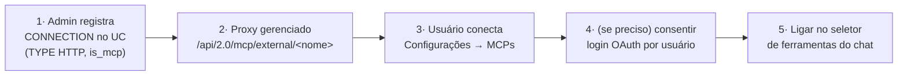

# Conectando MCPs ao AI Prism

Este guia mostra, de ponta a ponta, como dar ao AI Prism acesso a ferramentas
externas via **MCP (Model Context Protocol)** — de Slack a GitHub, Jira,
Salesforce ou um servidor próprio. São **duas etapas**:

1. **No Unity Catalog** — um administrador registra o servidor MCP como uma
   **conexão HTTP** governada (uma única vez por workspace).
2. **No AI Prism** — cada usuário **conecta** essa conexão em *Configurações →
   MCPs* e a liga no seletor de ferramentas do chat.

> **Por que via Unity Catalog?** O AI Prism nunca pede que o usuário cole uma URL
> arbitrária + segredo. Todo servidor MCP externo é uma conexão que um admin já
> registrou, e o **proxy gerenciado da Databricks** (`/api/2.0/mcp/external/…`)
> cuida da autenticação com o serviço de terceiros — inclusive consentimento
> OAuth por usuário quando aplicável. O AI Prism só **lista** essas conexões e as
> chama **em nome do usuário logado** (o bearer é sempre o token OAuth do próprio
> usuário — nenhuma credencial é armazenada no app).

---

## Visão do fluxo



---

## Pré-requisitos

- Um **workspace Databricks com Unity Catalog** e o **proxy MCP externo**
  habilitado (recurso `/api/2.0/mcp/external/`).
- Permissão de **admin do metastore/workspace** (ou `CREATE CONNECTION`) para
  registrar a conexão — etapa 1.
- A **URL do endpoint MCP** do serviço de terceiros e o método de autenticação
  que ele exige (bearer/token, OAuth, ou nenhum).

---

## Etapa 1 — Registrar a conexão no Unity Catalog (admin, uma vez)

Uma conexão MCP externa é uma `CONNECTION` do tipo `HTTP` com a opção
`is_mcp_connection = true`. É isso que a torna **descoberta** pelo AI Prism
(`server/externalMcp.js` filtra exatamente `connection_type = 'HTTP'` e
`options.is_mcp_connection = 'true'`).

### Opção A — SQL (recomendado)

```sql
-- Servidor MCP externo protegido por um bearer token estático.
CREATE CONNECTION IF NOT EXISTS slack_mcp
  TYPE HTTP
  OPTIONS (
    host 'https://mcp.example.com',          -- host do servidor MCP
    port '443',
    base_path '/mcp',                        -- caminho do endpoint MCP (Streamable HTTP)
    is_mcp_connection 'true',                -- OBRIGATÓRIO: marca como MCP para o AI Prism
    bearer_token '<SEGREDO>'                 -- credencial do serviço (fica no UC, não no app)
  )
  COMMENT 'Slack MCP — mensagens, canais e busca';
```

O `COMMENT` é importante: ele aparece como **descrição** na aba de MCPs do AI
Prism e alimenta a **busca semântica** de conexões (um usuário pode procurar
"ferramentas de mensagens" e achar `slack_mcp` sem citar o nome literal).

Para um servidor com **OAuth por usuário** (cada usuário consente uma vez), use
as opções OAuth da conexão HTTP em vez de `bearer_token`:

```sql
CREATE CONNECTION IF NOT EXISTS github_mcp
  TYPE HTTP
  OPTIONS (
    host 'https://api.githubcopilot.com',
    port '443',
    base_path '/mcp',
    is_mcp_connection 'true',
    oauth_client_id '<CLIENT_ID>',
    oauth_client_secret '<CLIENT_SECRET>',
    oauth_scope 'repo read:org',
    oauth_token_endpoint 'https://github.com/login/oauth/access_token',
    oauth_authorization_endpoint 'https://github.com/login/oauth/authorize'
  )
  COMMENT 'GitHub MCP — PRs, issues e código';
```

> **Segredos.** Prefira **referenciar um segredo** em vez de colar o valor em
> texto. Consulte a doc do seu workspace para a sintaxe de `SECRET(...)` nas
> opções de conexão HTTP disponível na sua versão.

### Opção B — UI do Catalog Explorer

1. **Catalog → External Data → Connections → Create connection**.
2. **Connection type:** `HTTP`.
3. Preencha **host**, **port** (`443`), **base path** (o caminho do endpoint MCP)
   e a autenticação (bearer/OAuth).
4. Marque/defina a opção **`is_mcp_connection = true`** (em versões que não expõem
   o toggle na UI, crie via SQL da Opção A — o flag é obrigatório).
5. Adicione um **comment** descritivo e salve.

### Conceder acesso (`USE CONNECTION`)

Os usuários do AI Prism só enxergam conexões às quais têm acesso. Conceda o
privilégio (a um grupo, de preferência):

```sql
GRANT USE CONNECTION ON CONNECTION slack_mcp TO `usuarios-ai-prism`;
```

### Verificar

```sql
SHOW CONNECTIONS;                 -- a conexão aparece na lista
DESCRIBE CONNECTION slack_mcp;    -- confira host/base_path/opções
```

O proxy gerenciado fica então acessível em
`https://<workspace-host>/api/2.0/mcp/external/slack_mcp`. O AI Prism monta essa
URL automaticamente (`externalMcpUrl()` em `server/externalMcp.js`).

---

## Etapa 2 — Conectar dentro do AI Prism (cada usuário)

1. Abra **Configurações (⚙) → aba MCPs**.
2. A aba lista todas as conexões MCP do workspace às quais você tem acesso, com
   nome e descrição. Use a **busca** (semântica) para filtrar por intenção
   — ex.: "e-mail e calendário", "código", "CRM".
3. Clique **Conectar** na conexão desejada. O AI Prism:
   - **adota** a conexão para o seu usuário (passa a aparecer no seletor de
     ferramentas do chat, ligada por padrão); e
   - **testa a autenticação** na hora, listando as tools do servidor em seu nome.
4. **Status** exibidos no chip da conexão:
   - **Conectado** — suas tools foram listadas; pronto para usar.
   - **Requer login** — o servidor exige **consentimento OAuth por usuário**. Um
     botão de **login** abre o fluxo do provedor numa nova aba; conclua o
     consentimento e clique em **Verificar**.
   - **Indisponível** — o servidor respondeu com erro (fora do ar, URL/segredo
     incorretos na conexão do UC, sem permissão). Verifique a Etapa 1.
5. Ligue a conexão no **seletor de ferramentas** (ícone de ferramentas no
   composer do chat). Conexões adotadas vêm **ligadas por padrão**; você pode
   desligar por conversa.

> **Autenticação é sempre "on-behalf-of".** O AI Prism chama o proxy MCP com o
> **seu** token OAuth (via *Streamable HTTP*, `server/mcpClient.js`). Ele não
> guarda nem vê o segredo do serviço — esse fica no Unity Catalog, e o proxy
> gerenciado da Databricks é quem o usa.

---

## Como o modelo usa as tools

Quando uma conexão está ligada, o AI Prism lista as tools do servidor MCP
(`tools/list`, com timeout de 4s para não travar o primeiro token do turno) e as
oferece ao modelo como **function-calling** normal, junto das ferramentas
nativas (Genie, UC Functions, Vector Search). O modelo decide quando chamá-las; o
AI Prism executa a chamada em seu nome e devolve o resultado ao modelo, que então
compõe a resposta. Se um servidor estiver lento ou fora do ar, aquela conexão
degrada para uma tool de "status" (com o motivo) em vez de travar o chat.

---

## Solução de problemas

| Sintoma | Causa provável | O que fazer |
| --- | --- | --- |
| Conexão não aparece na aba MCPs | Falta `is_mcp_connection = 'true'`, ou você não tem `USE CONNECTION` | Recrie via SQL com o flag; conceda o grant |
| Status **Requer login** que não some | Consentimento OAuth por usuário pendente | Clique em **login**, conclua no provedor, depois **Verificar** |
| Status **Indisponível** | host/base_path/segredo incorretos, ou servidor fora do ar | `DESCRIBE CONNECTION`; teste o endpoint MCP fora do Databricks |
| Aparece mas sem tools | O servidor não expôs tools ou excedeu o timeout de listagem | Verifique o servidor; tente novamente (o timeout é por turno) |
| Some depois de um tempo | O cache de catálogo do app expira em ~10 min | Reabra a aba MCPs para recarregar |

---

## Ver também

- **[mcp-microsoft-graph.md](./mcp-microsoft-graph.md)** — como conectar e-mail,
  calendário e arquivos da Microsoft **sem licença Copilot Studio Pro**,
  construindo um servidor MCP do zero sobre o Microsoft Graph.
- `server/externalMcp.js` — descoberta e probe das conexões.
- `server/mcpClient.js` — cliente Streamable HTTP (list/call tools).
- `client/src/components/McpConnectionsTab.jsx` — a aba de Configurações.
