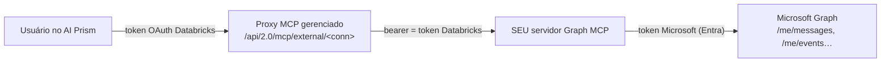

# AI Prism + Microsoft 365 (e-mail, calendário, arquivos) sem Copilot Studio Pro

**Pergunta que este documento responde:** um cliente que **não tem licença
Copilot Studio Pro** quer que o AI Prism leia/escreva o **e-mail e o calendário**
(Outlook/Exchange Online) dos seus usuários — e, opcionalmente, OneDrive/Teams.
Sem o conector gerenciado do Copilot Studio, a forma correta e suportada é
**construir um servidor MCP próprio sobre o Microsoft Graph** e registrá-lo como
uma conexão MCP externa (ver **[mcp-connections.md](./mcp-connections.md)**).

Este guia dá a **arquitetura recomendada**, os trade-offs de autenticação (a
parte que erra mais), um esqueleto de implementação e o passo-a-passo de
integração com o AI Prism.

> **Por que MCP, e não um "tool" nativo no AI Prism?** MCP é a fronteira de
> integração do AI Prism (`server/mcpClient.js` fala Streamable HTTP). Um servidor
> Graph MCP é reutilizável (qualquer cliente MCP o consome), fica **fora** do
> ciclo de deploy do app, e a governança (quem pode usar) vive no Unity Catalog.
> Nada de Graph entra no código do AI Prism.

---

## 1. A sutileza que define tudo: onde a autenticação Microsoft acontece

Entenda o caminho do token **antes** de escolher o design:



O AI Prism **sempre** chama o proxy da Databricks com o **token do Databricks do
usuário logado** (é o modelo on-behalf-of do app — `server/mcpClient.js` põe
`Authorization: Bearer <token-databricks>`). Esse token **não** é um token do
Microsoft Graph. Portanto:

> **O seu servidor Graph MCP é responsável por obter, sozinho, o token do
> Microsoft Graph.** Ele é um **app registrado no Microsoft Entra ID** (Azure AD)
> e faz sua própria autenticação contra a Microsoft. O que chega dele via
> Databricks é apenas **quem** é o usuário (identidade), não uma credencial
> Microsoft.

Isso deixa **duas** decisões independentes:

- **(A) Como o proxy Databricks autentica no seu MCP** (a "porta da frente"):
  bearer estático, ou OAuth por usuário — configurado nas *options* da conexão do
  Unity Catalog.
- **(B) Como o seu MCP autentica no Microsoft Graph** (a "porta dos fundos"):
  **app-only** (client credentials) ou **delegated por usuário**. É aqui que mora
  a decisão de arquitetura.

---

## 2. Escolha do modelo de auth para o Graph (a decisão B)

| | **App-only (client credentials)** | **Delegated por usuário (OAuth/OBO)** |
| --- | --- | --- |
| Quem age | Uma identidade de serviço (o app) | O usuário final, com as permissões dele |
| Consentimento | **Admin** consente uma vez (permissões *Application*) | Cada usuário consente uma vez (permissões *Delegated*) |
| Isolamento | O app pode ler **qualquer** caixa → **você** precisa restringir | Naturalmente limitado à caixa do próprio usuário |
| Endpoints Graph | `/users/{upn}/messages`, `/users/{upn}/events` | `/me/messages`, `/me/events` |
| Complexidade | Menor (1 fluxo de token) | Maior (login + refresh por usuário) |
| Melhor para | Piloto/1 tenant, automações, contas de serviço | Produção multiusuário, trilha de auditoria por pessoa |

### Recomendação

- **Piloto / prova de valor (padrão recomendado para começar):** **app-only**
  com **Application Access Policy** do Exchange **restringindo as caixas** a um
  grupo de segurança. Sobe rápido (um único fluxo de token), e o AI Prism mapeia
  a identidade do usuário → a caixa correta.
- **Produção multiusuário:** **delegated por usuário**. Cada pessoa só alcança o
  próprio e-mail/agenda por construção, com auditoria por usuário. Casa
  perfeitamente com o fluxo **"Requer login → Verificar"** que o AI Prism já
  mostra na aba de MCPs (o servidor devolve um erro de consentimento com o link
  de login; o usuário consente uma vez).

> **Princípio do menor privilégio.** Peça só os escopos necessários:
> `Mail.Read`/`Mail.Send`, `Calendars.Read`/`Calendars.ReadWrite`,
> `Files.Read` — delegated de preferência. **Nunca** peça `Mail.ReadWrite` de
> tenant inteiro sem necessidade. Em app-only, **sempre** limite com
> `New-ApplicationAccessPolicy`.

---

## 3. Identidade: ligando o usuário do Databricks à caixa Microsoft

O ponto crítico do modo **app-only**: o seu MCP precisa saber **de quem** é o
e-mail a acessar. Como o AI Prism chama em nome do usuário do Databricks, extraia
essa identidade no servidor MCP:

- O bearer que chega é o **token OAuth do Databricks** do usuário — valide-o e
  leia o **UPN/e-mail** dele (endpoint SCIM `Me` do Databricks, ou as claims do
  token). **Valide sempre** (assinatura + audiência); nunca confie num header
  arbitrário de identidade.
- Mapeie esse e-mail → o UPN do Microsoft 365 (o mais comum é serem **iguais** —
  mesmo IdP corporativo). Guarde um mapa explícito se divergirem.
- Faça as chamadas Graph com `/users/{upn}/…` (app-only) ou `/me/…` (delegated).

No modo **delegated**, o próprio consentimento OAuth por usuário já amarra a
identidade — o `/me` resolve para a pessoa que consentiu, e você não precisa de
mapa.

---

## 4. Ferramentas (tools) que o MCP deve expor

Modele **verbos claros e de baixo risco**, não um passe livre ao Graph. O modelo
do AI Prism chama estas tools por function-calling; nomes/descrições boas melhoram
o roteamento. O usuário do AI Prism é quem decide o que fazer com o resultado
(resumir, extrair to-dos, redigir resposta) — as tools só entregam dados/ações.

| Tool | Faz | Escopo Graph |
| --- | --- | --- |
| `list_recent_emails` | últimas N mensagens (assunto, remetente, snippet, data) | `Mail.Read` |
| `get_email` | corpo completo + anexos de uma mensagem por id | `Mail.Read` |
| `search_emails` | busca por remetente/assunto/período/texto (`$search`/`$filter`) | `Mail.Read` |
| `list_calendar_events` | eventos numa janela de datas | `Calendars.Read` |
| `create_calendar_event` | cria evento/convite | `Calendars.ReadWrite` |
| `send_email` | envia (ou cria rascunho de) e-mail | `Mail.Send` |
| `list_recent_files` | arquivos recentes do OneDrive (opcional) | `Files.Read` |

**Diretrizes:**
- **Escritas atrás de confirmação.** Deixe `send_email`/`create_calendar_event`
  criarem **rascunho** por padrão e só enviarem com um parâmetro explícito
  `confirm: true` — o modelo tende a agir cedo demais.
- **Pagine e limite** (`$top`, `$select`) para não despejar caixas inteiras no
  contexto do modelo.
- **`$delta` + change notifications** se precisar de sincronização eficiente
  (evita repuxar tudo a cada chamada).
- **Descrições ricas** em cada tool (o AI Prism as repassa ao modelo como
  function schema).

---

## 5. Esqueleto de implementação (Node + MCP SDK + MSAL)

Stack recomendada (mesma família do AI Prism): **Node.js**, `@modelcontextprotocol/sdk`
(transporte **Streamable HTTP** — o que `server/mcpClient.js` espera), `@azure/msal-node`
para tokens e os **Microsoft Graph SDKs**. Esboço app-only:

```js
// server.js — Graph MCP (app-only, resumido)
import express from 'express'
import { McpServer } from '@modelcontextprotocol/sdk/server/mcp.js'
import { StreamableHTTPServerTransport } from '@modelcontextprotocol/sdk/server/streamableHttp.js'
import { ConfidentialClientApplication } from '@azure/msal-node'
import { Client } from '@microsoft/microsoft-graph-client'

// --- porta dos fundos: token do Microsoft Graph (app-only) ---
const msal = new ConfidentialClientApplication({
  auth: {
    clientId: process.env.MS_CLIENT_ID,
    authority: `https://login.microsoftonline.com/${process.env.MS_TENANT_ID}`,
    // PREFIRA certificado (clientCertificate) a clientSecret em produção
    clientSecret: process.env.MS_CLIENT_SECRET,
  },
})
async function graphForUser(upn) {
  const { accessToken } = await msal.acquireTokenByClientCredential({
    scopes: ['https://graph.microsoft.com/.default'],
  })
  const client = Client.init({ authProvider: (done) => done(null, accessToken) })
  // app-only → sempre escopado a UMA caixa: /users/{upn}
  return { client, base: `/users/${encodeURIComponent(upn)}` }
}

// --- porta da frente: valida o token Databricks e extrai o usuário ---
async function resolveUser(req) {
  const token = (req.headers.authorization || '').replace(/^Bearer\s+/i, '')
  const upn = await verifyDatabricksTokenAndGetUpn(token) // valide assinatura+audiência!
  if (!upn) { const e = new Error('não autenticado'); e.status = 401; throw e }
  return upn
}

const mcp = new McpServer({ name: 'ms-graph', version: '1.0.0' })

mcp.tool(
  'list_recent_emails',
  'Lista os e-mails mais recentes do usuário (assunto, remetente, data, prévia).',
  { top: { type: 'number', default: 15 } },
  async ({ top }, { req }) => {
    const upn = await resolveUser(req)
    const { client, base } = await graphForUser(upn)
    const r = await client
      .api(`${base}/messages`)
      .top(Math.min(top ?? 15, 50))
      .select('subject,from,receivedDateTime,bodyPreview')
      .orderby('receivedDateTime DESC')
      .get()
    return { content: [{ type: 'text', text: JSON.stringify(r.value, null, 2) }] }
  }
)

mcp.tool(
  'send_email',
  'Envia um e-mail. Cria rascunho por padrão; só envia com confirm=true.',
  { to: {}, subject: {}, body: {}, confirm: { type: 'boolean', default: false } },
  async ({ to, subject, body, confirm }, { req }) => {
    const upn = await resolveUser(req)
    const { client, base } = await graphForUser(upn)
    const message = { subject, body: { contentType: 'HTML', content: body },
      toRecipients: [{ emailAddress: { address: to } }] }
    if (!confirm) {
      const draft = await client.api(`${base}/messages`).post(message)
      return { content: [{ type: 'text', text: `Rascunho criado (${draft.id}). Reenvie com confirm=true para disparar.` }] }
    }
    await client.api(`${base}/sendMail`).post({ message })
    return { content: [{ type: 'text', text: 'E-mail enviado.' }] }
  }
)

// ... list_calendar_events / create_calendar_event / search_emails análogos ...

const app = express()
app.post('/mcp', async (req, res) => {
  const transport = new StreamableHTTPServerTransport({ /* sessionId etc. */ })
  await mcp.connect(transport)
  await transport.handleRequest(req, res)
})
app.listen(process.env.PORT || 8080)
```

Para o modo **delegated**, troque `acquireTokenByClientCredential` pelo fluxo de
**OBO** (`acquireTokenOnBehalfOf`) ou por um **auth code + refresh token por
usuário**, e devolva um **erro de consentimento com URL de login** quando o
usuário ainda não consentiu — é exatamente o que o AI Prism traduz no status
**"Requer login"** com o botão que abre o fluxo (ver §7).

### Onde hospedar

- **Databricks App** própria (mesma conta, sem sair da Databricks), **Azure
  Container Apps / App Service** (mais perto do Entra/Graph), ou qualquer host com
  HTTPS público que o proxy da Databricks alcance. Precisa de **TLS** e ser
  acessível pela rede do workspace.

---

## 6. Registro do app no Microsoft Entra ID (uma vez)

1. **Entra ID → App registrations → New registration** (single- ou multi-tenant
   conforme o cliente).
2. **Certificates & secrets:** prefira **certificado** (X.509) a client secret;
   guarde em Key Vault. Considere **Workload Identity Federation** para eliminar
   segredos de longa duração.
3. **API permissions → Microsoft Graph:**
   - App-only: permissões **Application** (`Mail.Read`, `Mail.Send`,
     `Calendars.ReadWrite`, …) → **Grant admin consent**.
   - Delegated: permissões **Delegated** (mesmos nomes) → consentimento por
     usuário no primeiro uso.
4. **Restrinja o alcance (app-only):** crie um grupo de segurança com as caixas
   permitidas e aplique uma **Application Access Policy** no Exchange Online:
   ```powershell
   New-ApplicationAccessPolicy -AppId <MS_CLIENT_ID> `
     -PolicyScopeGroupId ai-prism-mailboxes@contoso.com `
     -AccessRight RestrictAccess `
     -Description "AI Prism Graph MCP — apenas caixas do piloto"
   ```
5. Anote **Tenant ID**, **Client ID** e o **caminho da credencial** para o deploy
   do MCP.

---

## 7. Integração com o AI Prism

Depois do MCP no ar (HTTPS), siga **[mcp-connections.md](./mcp-connections.md)** —
o AI Prism não distingue "Graph MCP" de qualquer outro MCP externo.

1. **Admin registra a conexão HTTP no Unity Catalog** apontando para o seu MCP:

   ```sql
   -- Porta da frente com bearer estático (o MCP valida por conta própria):
   CREATE CONNECTION IF NOT EXISTS microsoft_graph_mcp
     TYPE HTTP
     OPTIONS (
       host 'https://graph-mcp.suaempresa.com',
       port '443',
       base_path '/mcp',
       is_mcp_connection 'true',
       bearer_token '<TOKEN_DA_PORTA_DA_FRENTE>'   -- opcional; ver nota
     )
     COMMENT 'Microsoft 365 — e-mail e calendário via Microsoft Graph';

   GRANT USE CONNECTION ON CONNECTION microsoft_graph_mcp TO `usuarios-ai-prism`;
   ```

   > **Nota sobre a porta da frente vs. dos fundos.** O `bearer_token` acima
   > autentica o **proxy Databricks → seu MCP**. Ele é **diferente** do token
   > Microsoft (que o MCP obtém sozinho). No modo **delegated**, deixe as
   > *options* de OAuth da conexão dispararem o **login por usuário** — assim o
   > consentimento Microsoft acontece através do fluxo "Requer login" do AI Prism.

2. **Cada usuário conecta** em **Configurações → MCPs** e clica **Conectar**.
   - App-only bem configurado → status **Conectado** direto.
   - Delegated → status **Requer login**; o usuário clica em **login**, consente
     na tela da Microsoft e depois em **Verificar**.
3. **Ligar no seletor de ferramentas** do chat (vem ligado por padrão após
   conectar).
4. **Usar** — agora o usuário guia o AI Prism livremente:
   > *"Resuma meus e-mails não lidos de hoje e liste os to-dos que aparecem."*
   > *"Quais reuniões tenho amanhã? Prepare uma pauta para a das 14h."*
   > *"Rascunhe uma resposta ao último e-mail do fornecedor confirmando a
   > reunião de sexta."*

   O modelo chama as tools MCP, o AI Prism executa em nome do usuário e a resposta
   é composta pelo modelo — combinável com os demais recursos do app (gerar um
   deck da pauta, uma planilha dos to-dos, etc.).

---

## 8. Segurança, conformidade e operação (checklist)

- [ ] **Valide o token do Databricks** no MCP (assinatura + audiência); nunca
      confie num header de identidade solto.
- [ ] **Menor privilégio** nos escopos Graph; **delegated** sempre que possível.
- [ ] App-only **sempre** com **Application Access Policy** limitando as caixas.
- [ ] **Certificado/federated credentials** em vez de client secret; segredos em
      Key Vault; rotação e monitoramento.
- [ ] **Escritas** (`send_email`, `create_event`) atrás de `confirm=true`
      (rascunho por padrão).
- [ ] **Paginação/`$select`/`$delta`** para eficiência e para não estourar o
      contexto do modelo.
- [ ] **Throttling do Graph:** backoff exponencial com jitter + `Retry-After`;
      use os SDKs (retry embutido).
- [ ] **Auditoria:** logue chamadas de tool, consentimentos e uso do service
      principal no seu SIEM; revise permissões periodicamente.
- [ ] **Residência de dados:** o conteúdo de e-mail/agenda trafega
      Microsoft → seu MCP → AI Prism → modelo. Confirme que isso é aceitável para
      o cliente (o AI Prism roda no workspace do próprio cliente; os modelos são
      os do AI Gateway dele).

---

## 9. Alternativas consideradas

- **Copilot Studio Pro / conector gerenciado** — o caminho "sem código", mas
  exige a licença que o cliente **não tem**. Este guia é a alternativa.
- **Tool nativa no AI Prism** (UC Function/Python chamando o Graph) — possível,
  mas acopla credenciais Microsoft ao app e ao seu deploy, perde a governança do
  UC e não é reutilizável fora do AI Prism. **MCP é preferível.**
- **Logic Apps / Power Automate como fachada HTTP** — viável para poucos fluxos
  fixos, mas não expõe MCP nativamente e é menos flexível que um servidor MCP com
  tools bem modeladas.

---

## Referências

- On-Behalf-Of (OBO) flow — Microsoft identity platform.
- App-only access primer — Microsoft identity platform.
- Delta query & change notifications (Outlook).
- `New-ApplicationAccessPolicy` — restringir acesso a caixas (Exchange Online).
- Credenciais: certificados & Workload Identity Federation.
- Microsoft Graph throttling & retry.
- **[mcp-connections.md](./mcp-connections.md)** — como registrar a conexão no UC
  e conectá-la no AI Prism (o passo genérico que este guia especializa).
