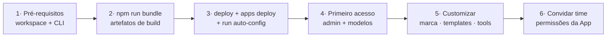

# Onboarding: seu próprio "ChatGPT" no Databricks em ~20 minutos

> **Aviso.** O AI Prism não é um produto oficial da Databricks e não tem SLA. É
> um acelerador open-source que **você deploya no seu próprio workspace** e
> customiza como quiser. Seus dados permanecem na sua conta Databricks e não são
> usados para treinar modelos de terceiros.

Este guia leva você de "workspace vazio" a "app rodando para o time" com **um
único comando**. Toda a infra (Lakebase, SQL Warehouse, App, dashboard, UDF) é
provisionada por um **Databricks Asset Bundle** — você não cria recursos à mão.

---

## Visão do fluxo



O passo 3 são três comandos (detalhados abaixo): **`bundle deploy`** provisiona a
infra — **Lakebase serverless** (produto *Autoscaling*: 0.5–16 CU, auto-stop em 30
min), **Serverless SQL Warehouse**, a **App** (com Lakebase e Warehouse anexados
como recursos, que injetam `PGHOST`/`SQL_WAREHOUSE_ID` na runtime) e o **dashboard
de custos**; **`apps deploy`** publica o código; e **`bundle run
ai_prism_auto_config`** cria o role PG do service principal, provisiona a UDF de
Python e o Volume de imagens, e semeia quem deployou como **admin bootstrap**.

---

## 1. Pré-requisitos (5 min)

- Um **workspace Databricks** (AWS, Azure ou GCP) com Unity Catalog habilitado.
- **AI Gateway / Foundation Model APIs** disponíveis na região (endpoints
  `databricks-claude-*`, `databricks-gpt-*`, etc.).
- **Databricks CLI recente (≥ ~1.x; idealmente ≥ 1.8)** autenticada num profile
  para o workspace. CLIs antigas (ex.: 0.29x) falham ao baixar o Terraform interno
  com `openpgp: key expired` no `bundle deploy`. A CLI ≥ 1.8 guarda a credencial no
  keyring do SO (se um token antigo em cache atrapalhar, rode `databricks auth login`
  de novo ou exporte `DATABRICKS_AUTH_STORAGE=plaintext`).
  ```bash
  # Azure: use o host do seu workspace (adb-<id>.<n>.azuredatabricks.net)
  databricks auth login --host https://<seu-workspace> -p <PROFILE>
  ```
- Permissão para criar **Databricks App**, **SQL Warehouse**, **Lakebase** e
  **Jobs** (o bundle cria todos). Para a UDF de Python e o Volume de imagens, você
  precisa poder criar (ou já ter) o catálogo `ai_prism` — se não tiver `CREATE
  CATALOG` no metastore, aponte para um catálogo existente com
  `--var tools_catalog=<cat> --var image_volume_catalog=<cat>`.
- Por padrão o bundle **cria** o SQL Warehouse. Para reaproveitar um que já
  existe, deploie com `--var warehouse_id=<id>` — você precisa de **CAN_MANAGE**
  nesse warehouse, porque o recurso `sql-warehouse` da App concede CAN_USE ao
  service principal dela (sem CAN_MANAGE o deploy falha ao aplicar o grant).
  Nesse caso o bundle ainda cria o warehouse dele, que fica sem uso: se você não
  quer isso, remova o bloco `sql_warehouses` do `databricks.yml`.
- **Node.js 18+** e **npm** para o build local. Instale o toolchain com
  `npm run setup` (não `npm install` puro — ver passo 2). Atrás de um
  registry/proxy corporativo? Configure o npm antes (`npm config set registry
  <url>` + vars de proxy); o repo não impõe registry, então o seu `~/.npmrc` vale.

**Checagem:** `databricks current-user me -p <PROFILE>` retorna seu e-mail.

> **Nota (cloud-agnóstico):** o `databricks.yml` **não** fixa host de workspace —
> o alvo do deploy vem inteiramente do profile do `-p <PROFILE>`. O mesmo bundle
> deploya em AWS, Azure ou GCP sem editar arquivo nenhum. Se a sua CLI ≥ 1.8
> reclamar de credencial em cache de versão antiga, exporte
> `DATABRICKS_AUTH_STORAGE=plaintext` ou rode `databricks auth login` de novo.

---

## 2. Build dos artefatos (2 min)

A App roda os artefatos pré-compilados (`client/dist` + `server-dist/index.cjs`),
não o código-fonte — então **sempre** reconstrua antes de deployar:

```bash
npm run setup          # só na 1ª vez: instala o toolchain de build (ver nota abaixo)
npm run bundle         # client/dist + server-dist/index.cjs
```

> **Nota (devDeps):** o `.npmrc` tem `omit=dev`, então um `npm install` puro **não
> instala** o toolchain de build (que vive todo em `devDependencies`) e o
> `npm run bundle` falharia. Use `npm run setup`
> (= `npm install --include=dev --ignore-scripts`). O `bundle` tem um guard que
> avisa, com a instrução exata, se o toolchain estiver faltando.

---

## 3. Deploy da stack completa (5 min)

Três comandos provisionam a infra, publicam o código da App e a configuram:

```bash
# valida a configuração do bundle (não cria nada)
databricks bundle validate -p <PROFILE> -t dev

# 1) provisiona Lakebase + Warehouse + App + dashboard + job
databricks bundle deploy -p <PROFILE> -t dev

# 2) publica o CÓDIGO da App (o bundle deploy sozinho NÃO republica o processo
#    em execução). O <SRC> é o caminho impresso pelo deploy / bundle summary,
#    tipicamente /Workspace/Users/<você>/.bundle/ai-prism/dev/files
databricks apps deploy ai-prism --source-code-path <SRC> -p <PROFILE>

# 3) roda o job de auto-config: cria o role PG do service principal, provisiona a
#    UDF Python + Volume de imagens (catálogo ai_prism) e semeia o admin bootstrap
databricks bundle run ai_prism_auto_config -p <PROFILE> -t dev
```

O que o bundle (`databricks.yml`) gerencia:

| Recurso | Configuração |
|---|---|
| **Lakebase** (`postgres_projects` + `postgres_endpoints`) | serverless, autoscaling **0.5–16 CU**, **auto-stop 30 min** |
| **SQL Warehouse** (`sql_warehouses`) | Serverless, 2X-Small, Photon, auto-stop 10 min |
| **App** (`apps`) | Lakebase e SQL Warehouse anexados como **recursos da App** (a runtime injeta `PGHOST`/`SQL_WAREHOUSE_ID`); env estático no `app.yaml` |
| **Dashboard de custos** (`dashboards`) | Lakeview de auditoria de custos (system tables) |
| **Job de auto-config** (`jobs`) | cria o **role Postgres do SP** do app no Lakebase (`databricks_create_role`), a UDF `ai_prism_python_exec` e o Volume de imagens (tudo no catálogo `ai_prism`), e **semeia o admin bootstrap** (quem deployou) na tabela `app_admins` |

> **Alvos:** `dev` (padrão, prefixa recursos com seu usuário — bom para testar) e
> `prod` (nomes limpos, para o deploy oficial). Troque `-t dev` por `-t prod`
> quando for para valer. Nenhum dos alvos fixa host — o workspace vem do
> `-p <PROFILE>`, então não é preciso editar o `databricks.yml`.

> **Sobre a conexão com o Lakebase:** o `PGHOST` é injetado automaticamente pela
> runtime da App a partir do recurso `lakebase` (não é hardcoded em lugar nenhum —
> por isso o mesmo bundle funciona em qualquer cloud). O app conecta como o **service
> principal dele** (o job cria o role Postgres do SP); o isolamento por usuário é
> app-level (`WHERE user_email`).

Ao final, `databricks bundle summary -p <PROFILE> -t dev` mostra a URL pública da
App (atrás do OAuth do workspace).

### Sobre a UDF de Python (`execute_python`)

O AI Prism embarca a própria UDF (`ai_prism_python_exec`) em vez de usar
`system.ai.python_exec`: a nossa respeita uma variável `result`, captura `stdout`
**e** trata exceções retornando `"ERROR: ..."` sem derrubar a query — a função de
plataforma falha a statement inteira em qualquer erro. A definição vive em
`shared/pythonUdf.js` (fonte única); o job de deploy usa a versão gerada em
`bundle/python_udf_ddl.py` (via `node scripts/gen-python-udf-ddl.mjs`), e o app a
provisiona também em runtime — as duas são idênticas byte a byte.

`TOOLS_CATALOG` / `TOOLS_SCHEMA` definem **apenas onde essa UDF é criada** — não
limitam quais UC Functions o usuário pode anexar como tool. A descoberta de UC
Functions varre todos os catálogos/schemas que o usuário enxerga (via
`system.information_schema.routines`, exceto `system`), sempre escopada pelas
permissões reais dele no Unity Catalog.

### Sobre o Volume de imagens geradas

As imagens geradas/editadas no chat têm bytes reais, então vão para um **UC Volume
dedicado** — mantido separado do catálogo de tools para não misturar com outros
assets. O caminho é configurável por `IMAGE_VOLUME_CATALOG` / `IMAGE_VOLUME_SCHEMA`
/ `IMAGE_VOLUME_NAME` (default `ai_prism.default.ai_prism_images`). O job de
auto-config cria o catálogo/schema/volume e concede `READ/WRITE VOLUME` ao
**service principal do app** — o app escreve/lê as imagens como o SP (não pelo
token OAuth do usuário), evitando depender do escopo `files` reconsentido no
browser. O isolamento por usuário continua **app-level** (`WHERE user_email` em
`chat_images`), como todo artefato. O **modelo de imagem padrão é o Nano Banana 2**.

---

## 4. Primeiro acesso e configuração de modelos (5 min)

1. Abra a URL da App e autentique com sua conta do workspace.
2. Como o deployer, o job de auto-config já te semeou como **admin** (tabela
   `app_admins`), então você verá as abas de **admin** em *Configurações*.
3. **Modelos (LLM)**: habilite os endpoints de serving que o time deve usar e
   defina rótulos/ordem. Só os habilitados aparecem para usuários comuns.
4. **Custos de IA**: a auditoria de custos vive no **dashboard AI/BI** provisionado
   pelo bundle (não em uma aba do app) — abra-o no workspace e **publique** para os
   demais admins. Detalhes em [`dashboards/README.md`](../dashboards/README.md).

---

## 5. Customização (opcional, quando quiser)

- **Marca / design system**: em *Configurações → Templates de apresentação*,
  importe o design system da empresa (cores, fontes, logo, ícones — de um `.pptx`
  de marca ou de um bundle). Decks e planilhas passam a sair no seu visual.
- **Ferramentas**: conecte **Genie Agents**, **UC Functions** e **Vector Search**
  como tools do chat; adicione **conexões MCP externas** se necessário.
- **UI/features**: o código é seu — ajuste textos, tema e comportamento, rode
  `npm run bundle` e redeploye com `databricks bundle deploy`.

---

## 6. Convidar o time (2 min)

- Dê à App a permissão **CAN_USE** para os usuários/grupos que devem acessá-la
  (UI de permissões da App, ou API).
- Para adicionar outros **administradores**, use *Configurações → Administradores*
  dentro do app (o autocomplete sugere quem já tem acesso).
- Cada usuário passa a operar com a **própria identidade**: conversas, permissões
  de dados e custo são atribuídos a ele.

---

## Resolvendo problemas comuns

| Sintoma | Causa provável | Ação |
|---|---|---|
| `bundle deploy` falha em Lakebase/endpoint | recurso serverless Postgres indisponível na região/conta | confirme disponibilidade do Lakebase serverless; ajuste `databricks.yml` |
| Chat falha com **"External authorization failed"** / 0 tabelas no Lakebase | login do SP no Lakebase rejeitado (SQLSTATE 28000): role do SP não criado, ou `PGHOST` apontando pro Lakebase errado (nunca hardcode host no `app.yaml`!) | rode `databricks bundle run ai_prism_auto_config` (cria o role do SP); confirme que o recurso `lakebase` está anexado à App |
| Tool `execute_python` some | UDF não provisionada | rode `databricks bundle run ai_prism_auto_config` (ou o app a cria no 1º uso) |
| Modelos não aparecem | Nenhum endpoint habilitado no catálogo | Admin → *Modelos (LLM)* → habilite |
| Não vejo as abas de admin | admin bootstrap não semeado | rode `databricks bundle run ai_prism_auto_config` (semeia o deployer em `app_admins`) |
| Mudança no código sem efeito | `bundle deploy` não republica o código da App | rode `npm run bundle` e depois `databricks apps deploy ai-prism --source-code-path <SRC>` |

---

*Fluxo desenhado para o cliente deployar e operar o AI Prism no próprio
workspace. O host **nunca** é editado no `databricks.yml` — ele vem do
`-p <PROFILE>`, então o mesmo bundle roda em AWS/Azure/GCP. Ajuste apenas
targets/nomes de recurso se quiser.*
