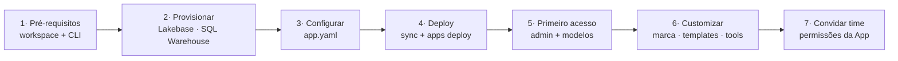

# Onboarding: seu próprio "ChatGPT" no Databricks em ~30 minutos

> **Aviso.** O AI Prism não é um produto oficial da Databricks e não tem SLA. É
> um acelerador open-source que **você deploya no seu próprio workspace** e
> customiza como quiser. Seus dados permanecem na sua conta Databricks e não são
> usados para treinar modelos de terceiros.

Este guia leva você de "workspace vazio" a "app rodando para o time", no menor
número de passos. O objetivo é conveniência: a maior parte é copiar-colar.

---

## Visão do fluxo



Cada etapa abaixo é independente e verificável antes de seguir.

---

## 1. Pré-requisitos (5 min)

- Um **workspace Databricks** (AWS, Azure ou GCP) com Unity Catalog habilitado.
- **AI Gateway / Foundation Model APIs** disponíveis na região (os endpoints
  `databricks-claude-*`, `databricks-gpt-*`, etc.).
- **Databricks CLI** autenticada num profile para o workspace:
  ```bash
  databricks auth login --host https://<seu-workspace>.cloud.databricks.com -p <PROFILE>
  ```
- Permissão para criar: uma **Databricks App**, um **SQL Warehouse** e uma
  instância **Lakebase**.

**Checagem:** `databricks current-user me -p <PROFILE>` retorna seu e-mail.

---

## 2. Provisionar os recursos de dados (10 min)

O AI Prism precisa de dois recursos além da própria App:

**a) Lakebase (Postgres gerenciado)** — guarda sessões, mensagens, templates de
design e os embeddings do RAG.
- Crie uma instância Lakebase no workspace (UI: *Compute → Database Instances →
  Create*, ou CLI). Anote o **host** (`ep-....database.<region>.cloud.databricks.com`)
  e o **database** (`databricks_postgres` por padrão).
- Não é preciso criar tabelas — o app roda o schema (incl. a extensão `pgvector`)
  na primeira subida.

**b) SQL Warehouse (serverless)** — executa as *tools* (Unity Catalog Functions)
e alimenta o painel de **Custos de IA** (lê as *system tables*).
- Crie um **Serverless SQL Warehouse** e anote o **ID** (aparece na URL/detalhes).

> Dica de custo: warehouse serverless só fatura quando consultado; a primeira
> query "acorda" o compute em alguns segundos. O app trata isso com um spinner.

---

## 3. Configurar o `app.yaml` (5 min)

O `app.yaml` já vem no repositório; ajuste os valores para o seu ambiente:

```yaml
command: ["node", "server-dist/index.cjs"]

# Scopes OAuth mínimos p/ tudo funcionar on-behalf-of do usuário logado
user_authorization:
  scopes:
    - model-serving      # AI Gateway (chat + embeddings)
    - genie              # Genie Agents / Genie One
    - sql                # SQL Warehouse: tools + system tables (custos)
    - vector-search      # Vector Search (tool)
    - catalog.connections
    - mcp.external        # conexões MCP externas

env:
  - { name: APP_OWNER_EMAIL, value: "voce@empresa.com" }   # 1º admin (bootstrap)
  - { name: DATABRICKS_APP_NAME, value: "ai-prism" }
  - { name: PGHOST, value: "ep-....database.<region>.cloud.databricks.com" }
  - { name: PGDATABASE, value: "databricks_postgres" }
  - { name: PGPORT, value: "5432" }
  - { name: PGSSLMODE, value: "require" }
  - { name: SQL_WAREHOUSE_ID, value: "<id-do-warehouse>" }
  - { name: TOOLS_CATALOG, value: "main" }
  - { name: TOOLS_SCHEMA, value: "default" }
```

- **`APP_OWNER_EMAIL`** é a peça-chave do onboarding: essa identidade é sempre
  admin e pode promover outros admins pela própria UI. Comece com o seu e-mail.
- Nenhuma senha/credencial estática: em produção o runtime injeta o token OAuth
  do usuário logado, usado tanto no AI Gateway quanto no Lakebase.

---

## 4. Build e deploy (5 min)

> **Sempre** reconstrua os artefatos antes de deployar — a App executa
> `client/dist` + `server-dist/index.cjs`, não o código-fonte.

```bash
# 1. reconstrua os artefatos que a App realmente executa
npm ci --include=dev      # (só na 1ª vez; ver nota sobre devDeps abaixo)
npm run bundle            # client/dist + server-dist/index.cjs

# 2. sincronize o projeto para a pasta da App no Workspace
databricks sync . /Workspace/Users/<voce>/apps/ai-prism -p <PROFILE> --full

# 3. crie a App (1ª vez) e faça o deploy
databricks apps create ai-prism -p <PROFILE>   # só na primeira vez
databricks apps deploy ai-prism \
  --source-code-path /Workspace/Users/<voce>/apps/ai-prism -p <PROFILE>

# 4. confira o estado
databricks apps get ai-prism -p <PROFILE>   # compute ACTIVE + deployment SUCCEEDED
```

> **Nota (devDeps):** neste projeto, `npm install <pkg>` avulso pode podar as
> devDependencies necessárias ao build. Use `npm ci --include=dev` /
> `npm install --include=dev`.

Ao final, `databricks apps get` mostra a URL pública da App (atrás do OAuth do
workspace).

---

## 5. Primeiro acesso e configuração de modelos (5 min)

1. Abra a URL da App e autentique com sua conta do workspace.
2. Como você é o `APP_OWNER_EMAIL`, verá as abas de **admin** em *Configurações*.
3. **Modelos (LLM)**: o catálogo lista os endpoints de serving disponíveis.
   Habilite os que o time deve usar e defina rótulos/ordem. Só os habilitados
   aparecem para usuários comuns.
4. **Custos de IA**: confirme que o painel carrega (valida o SQL Warehouse e o
   acesso às *system tables*).

---

## 6. Customização (opcional, quando quiser)

- **Marca / design system**: em *Configurações → Templates de apresentação*,
  importe o design system da empresa (cores, fontes, logo, ícones — de um `.pptx`
  de marca ou de um bundle). Decks e planilhas passam a sair no seu visual.
- **Ferramentas**: conecte **Genie Agents**, **UC Functions** e **Vector Search**
  como tools do chat; adicione **conexões MCP externas** se necessário.
- **UI/features**: o código é seu — ajuste textos, tema e comportamento e
  redeploye (`npm run bundle` + `apps deploy`).

---

## 7. Convidar o time (2 min)

- Dê à App a permissão **CAN_USE** para os usuários/grupos que devem acessá-la
  (UI de permissões da App, ou API).
- Para adicionar outros **administradores**, use *Configurações → Administradores*
  dentro do app (o autocomplete sugere quem já tem acesso).
- Cada usuário passa a operar com a **própria identidade**: as conversas,
  permissões de dados e o custo são atribuídos a ele.

---

## Resolvendo problemas comuns

| Sintoma | Causa provável | Ação |
|---|---|---|
| Painel de custos vazio / erro 503 | SQL Warehouse frio ou sem scope `sql` | Aguarde o warm-up; confirme o scope e o `SQL_WAREHOUSE_ID` |
| "password authentication failed" (Lakebase) | Token/credencial expirada (dev local) | Regenere a credencial; em produção o token do usuário é injetado |
| Modelos não aparecem | Nenhum endpoint habilitado no catálogo | Admin → *Modelos (LLM)* → habilite |
| Deploy sem efeito | Esqueceu de `npm run bundle` | Rebuild + `sync` + `deploy` novamente |

---

*Fluxo desenhado para o cliente deployar e operar o AI Prism no próprio
workspace. Ajuste caminhos/nomes conforme sua organização.*
